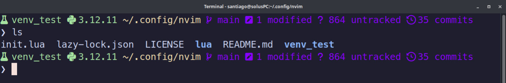

# Bash Prompt for Developers / Prompt de Bash para Desarrolladores

## 🇬🇧 English Introduction

This is a personal repository containing a clean and efficient bash prompt configuration designed for developers.  
I created this because I felt unsatisfied with **oh-my-bash** — while I think it's a great project, it didn't quite align with my preferences for simplicity.  
Anyone can use this configuration to enhance their terminal experience with a professional-looking prompt that displays useful information for development workflows.

---

## 🇪🇸 Introducción en Español

Este es un repositorio personal que contiene una configuración de prompt de bash limpia y eficiente diseñada para desarrolladores.  
Creé esto porque me sentía insatisfecho con **oh-my-bash** — aunque me parece un proyecto genial, no acababa de encajar conmigo y mi preferencia por la simplicidad.  
Cualquier persona puede usar esta configuración para mejorar su experiencia en la terminal con un prompt de apariencia profesional que muestra información útil para flujos de trabajo de desarrollo.

---

## ⚙️ Requirements

To ensure your Bash prompt looks and works exactly as intended, make sure you have the following:

### 🧠 Bash Version
```bash
bash --version
```
Output example:
```
GNU bash, version 5.3.3(1)-release (x86_64-solus-linux-gnu)
Copyright (C) 2025 Free Software Foundation, Inc.
License GPLv3+: GNU GPL version 3 or later <http://gnu.org/licenses/gpl.html>
```

> This configuration was tested with **GNU Bash 5.3.3**, but it should work on Bash 4.4+ without issues.


### 💬 Terminal Font
**Font:** `MesloLGS DZ Nerd Font` (size 11pt)

> Nerd Fonts are recommended to properly display icons.  
> You can download it from [https://www.nerdfonts.com/font-downloads](https://www.nerdfonts.com/font-downloads)


✅ **Optional:** Make sure your terminal supports UTF-8 and TrueColor (24-bit color) for best appearance.

---

## 🧩 File Structure: `bashrc_config.txt`

This configuration file is organized in a clean and modular way to make it easy to understand, customize, and extend.

### 1. 🎨 Color Theme Section
```bash
# ====== COLORS THEME START ======
# Base colors
COLOR1="\[\e[32m\]"   # Green
COLOR2="\[\e[34m\]"   # Blue
COLOR3="\[\e[33m\]"   # Yellow
COLOR4="\[\e[36m\]"   # Cyan
COLOR5="\[\e[31m\]"   # Red

# Specific colors
COLOR6="\[\e[35m\]"      # For Python
COLOR7="\[\e[38;5;93m\]" # For Git
COLOR8="\[\e[38;2;255;255;255m\]"  # Pure White, for terminal and ❯

# ====== COLORS THEME END ======
```
Defines all ANSI color codes used in the prompt.  
You can easily change these to adjust the color scheme to your liking.

---

### 2. 🐍 Python Version Cache
```bash
cache_python_version() {
  ...
}
```
This function checks and stores the current Python version.  
It runs automatically whenever you change directories (`chpwd()`), keeping the prompt up to date without unnecessary performance cost.

---

### 3. 🌿 Git Branch and Repository Info
```bash
parse_git_branch() {
  ...
}
```
Displays detailed Git information:
- Current branch name  
- Number of commits  
- Number of staged, modified, and untracked files  

Includes icons for readability and visual structure.

---

### 4. ⚗️ Python Virtual Environment Info
```bash
venv_info() {
  ...
}
```
Shows the current Python virtual environment (venv or conda) and the active Python version.  
If no environment is active, it stays hidden to keep the prompt clean.

---

### 5. 💡 Prompt Construction (PS1)
```bash
P
S1_CUSTOM="${COLOR1}\$(venv_info)${COLOR3}\w ${COLOR7}\$(parse_git_branch)\n${COLOR8}❯"
export PS1=$PS1_CUSTOM
```
Defines the final Bash prompt (`PS1`), combining:
- The virtual environment info  
- The current working directory  
- Git branch and status  
- Active jobs (if any)  
- And finally the command line symbol `❯`

---

🧠 **Tip:** Each function can be modified or extended individually without breaking the rest of the prompt.

---

## ⚙️ Installation

### Step 1: Clone the repository
```bash
git clone https://github.com/santycorreav/bash_prompt_simple_developer
```

### Step 2: Navigate to the directory
```bash
cd bash_prompt_simple_developer
```

### Step 3: Backup your current bash configuration
```bash
cp ~/.bashrc ~/.bashrc.backup
```

### Step 4: Source the new prompt configuration
```bash
echo "source ~/bash_prompt_simple_developer/bashrc_config.txt" >> ~/.bashrc
```

### Step 5: Reload your bash configuration
```bash
source ~/.bashrc
```

✅ **Done!** Your bash prompt is now configured with developer-friendly settings.

---

## 🌟 Features

- Clean and professional appearance  
- Git branch status integration  
- Color-coded elements for better readability  
- Developer-focused information display  
- Minimal and lightweight (no heavy frameworks)  
- Easy to customize and extend  

---

## 🖼️ Preview



A clean and minimal Bash prompt showing:
- Current directory path
- Active Python virtual environment (if any)
- Git branch, commits, and file status
- Developer-friendly icons and color-coded information

---

## 👨‍💻 Author

**Santiago Correa Vergara**

